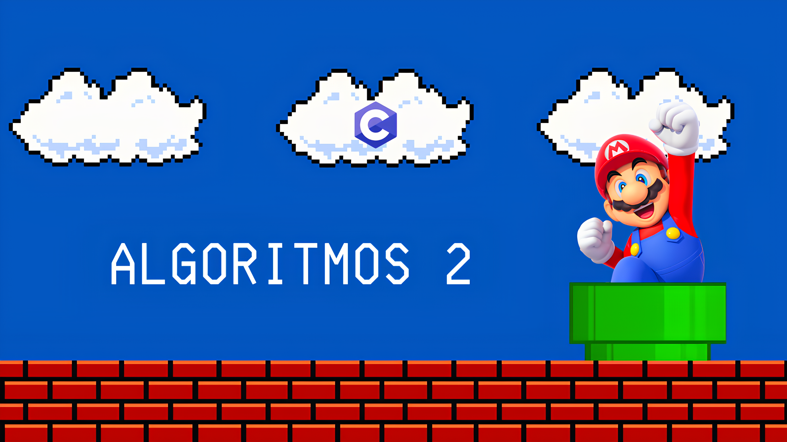

# ENGENHARIA DE COMPUTAÇÃO - ALGORITMOS II / 2025



## SOBRE O REPOSITÓRIO

Projeto desenvolvido ao longo de todo o **2º semestre** do curso de **Engenharia de Computação do IFMS - Campus Três Lagoas**, com o auxílio dos professores **Rogério Antoniassi** e **Alex Araujo**.

---

## FUNCIONALIDADE

Neste repositório, você encontra uma coleção de **algoritmos** e **exercícios de programação** desenvolvidos na **linguagem C**, com foco em:

- Estudo e compreensão de algoritmos;
- Aprimoramento da lógica de programação;
- Desenvolvimento prático durante as aulas.

---

## COMO COMPILAR PELO TERMINAL

### Requisitos

- **GCC** (para compilar os arquivos C);
- **Sistema operacional** de sua escolha (para executar no terminal);
- **Git** (opcional, para clonar o repositório).

### Passo a passo

```bash
# Clone o repositório
git clone https://github.com/seu_usuario/algoritmos2.git
cd algoritmos2
```

```bash
# Compile o arquivo desejado com o GCC
gcc nome_do_arquivo.c -o nome_do_programa
```

```bash
# Execute o programa
./nome_do_programa
```

#### Compilando códigos que usam a biblioteca matemática `<math.h>`

```bash
gcc nome_do_arquivo.c -o nome_do_programa -lm
```

> Isso é necessário para todos os códigos da pasta `lista-funcoes`.

---

## OBSERVAÇÕES

- **Ambiente de desenvolvimento**: Ubuntu (Editor de Texto) e Visual Studio Code
- **Compiladores utilizados**: GCC (local) e [OnlineGDB](https://www.onlinegdb.com)
- **Sistema operacional**: Linux Ubuntu 24.04.2 LTS
- **Versão do GCC**: 13.3.0

---

## AUTORIA

**Isadora de Souza Martins**  
Estudante de Engenharia de Computação  

- GitHub: [isamartins-engcomput](https://github.com/isamartins-engcomput)
- E-mail pessoal: isadoramartins1906@gmail.com
- E-mail institucional: isadora.martins2@estudante.ifms.edu.br

---

> É isso, espero que gostem do meu trabalho produzido até aqui! :)
